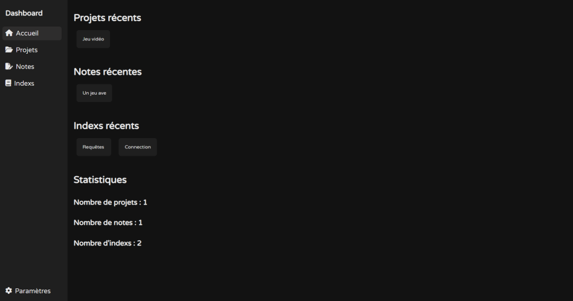

# dashboard-example
Un tableau de bord personnalisé réalisé en PHP



__Fonctionnalités :__

<li>Création, modification et suppression de projets</li>
<li>Création, modification et suppression de notes</li>
<li>Création, modification et suppression d'indexs</li>
<li>Conversion et téléchargement de projets en PDF</li>
<li>Assosiation de plusieurs notes à un projet</li>
<li>Modification du nom et du thème visuel du site</li>

<br>

__Utilisation :__

Importez le fichier __dashboard.sql__ sur votre base de données à l'aide de votre outil favori

Dans le fichier __config/database.php__ changez ces 4 lignes avec les identifiants de connexion à votre base de données

```php
$host = "localhost";
$bdd = "dashboard";
$user = "root";
$passwd = "";
```

<br>

__Personalisation :__

Le tableau de bord permet d'avoir plusieurs thèmes, pour en rajouter, rajouter ce morceau de code dans le fichier `assets/css/style.php`

```php
else if($row['theme'] == 3) {
    echo"
    :root {
    --background_color: #202327;
    --sidebar_color: #282d34;
    --button_color: #282d34;
    --button_color_hover: #333942;
    --text_color: #ccd4f5;
    }";
    }
```

N'oubliez pas de changer la valeur de 3 à 4 par exemple

Ensuite dans le fichier `settings/index.php`, rajoutez ce bout de code

```php
else if($row['theme'] == 3) {
    echo "<option value='0'>Clair</option>
    <option value='1'>Sombre</option>
    <option value='2'>Gris</option>
    <option value='3' selected>Bleu sombre</option>";
}
```

Changez le 3 en 4 par exemple pour votre nouveau thème et copiez cette ligne dans chaque autres précédents blocs

```html
<option value='4' selected>Bleu sombre</option>";
```

N'oubliez pas de mettre l'option "selected" à côté de votre theme seulement dans le bloc correspondant au theme et de ne pas mettre le "selected" dans les autres blocs

Si les icônes de certification ou de type de membres ne vous plaisent pas, vous pouvez les changer dans ce fichier `config/badges.php`

<br>

__Test du projet :__

Utilisez un logiciel de wamp tel que [Wamp server](https://www.wampserver.com/) par exemple
<br>
Mettez le dossier du projet dans le dossier __www__ du logiciel de Wamp et lancer le projet depuis votre navigateur web
<br><br>
Vous pouvez aussi l'hoster sur votre propre site web/serveur
